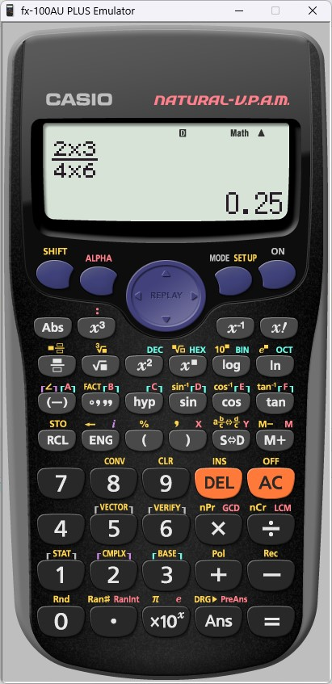
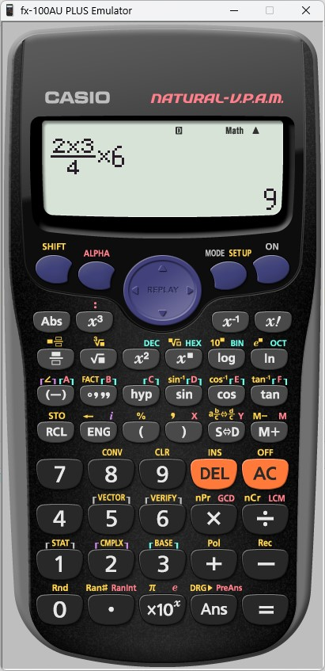

# Why-do-you-need-parentheses-in-programs
__Зачем нужны скобки в программах!__

*(2+3)/(4+6) = 0.5*


*2+3/(4+6) = 2.3*


*(2+3)/4+6 = 7.25*


*2+3/4+6 = 8.75*


*(2\*3)/(4\*6) = 0.25*



*(2\*3)/4\*6 = 9*



***Программа на Python для сомнивающихся: ))***
```
a = 2
b = 3
c = 4
d = 6
x1 = (a + b) / (c + d)
x2 = a + b / (c + d)
x3 = (a + b) / c + d
x4 = a + b / c + d
x5 = (a * b) / (c * d)
x6 = (a * b) / c * d
print(x1)
print(x2)
print(x3)
print(x4)
print(x5)
print(x6)
```

